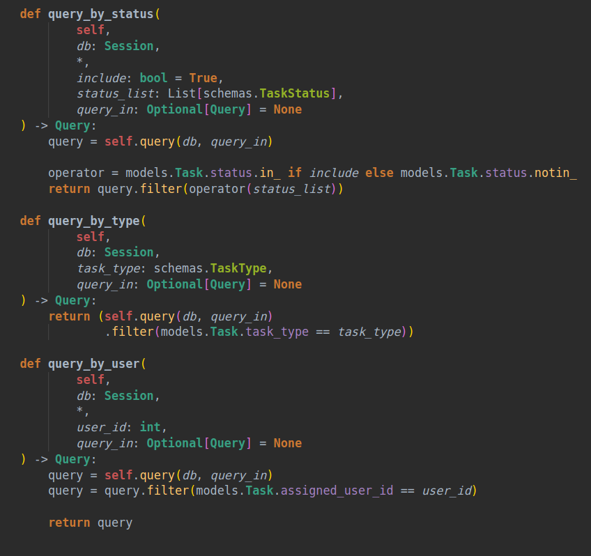

# Monoviz Theme

Reworked "Darcula Theme inspired by IntelliJ" with better support for Python (mostly) and other languages using semantic highlighting.

## Installation

- clone this repository and go to root directory
- `npm install -g vsce`
- `vsce package`
- `code --install-extension monoviz-[version].vsix`

## Preview

## Contributing

If you'd like to contribute to this theme, please post an issue or PR on [GitHub](https://github.com/szymswiat/monoviz-theme).
